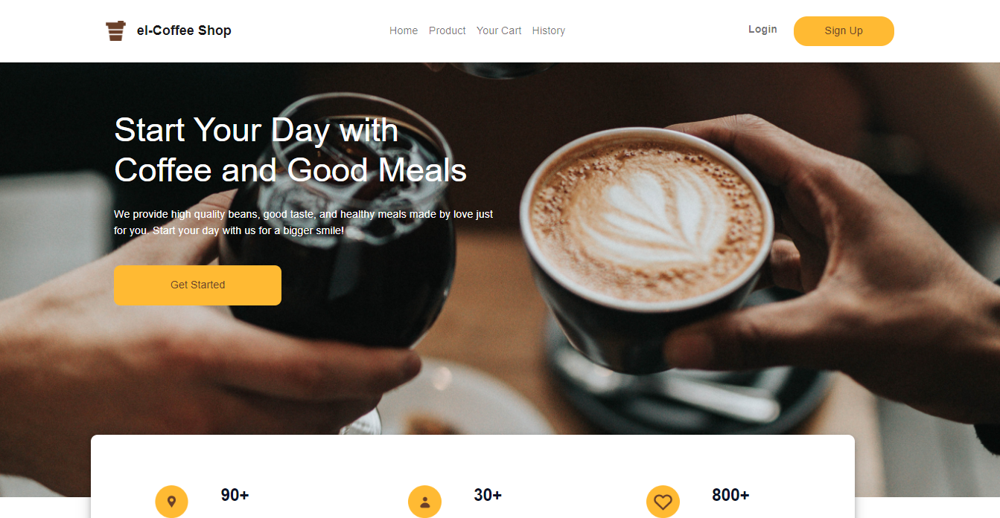
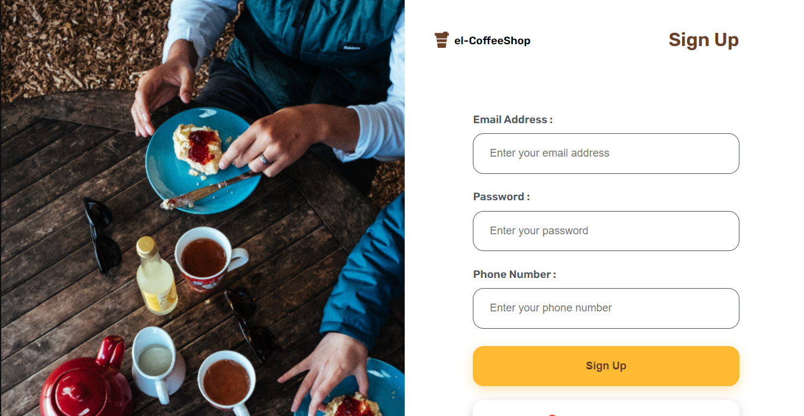
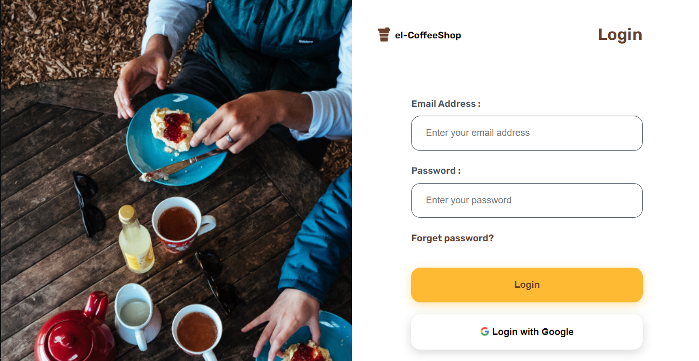
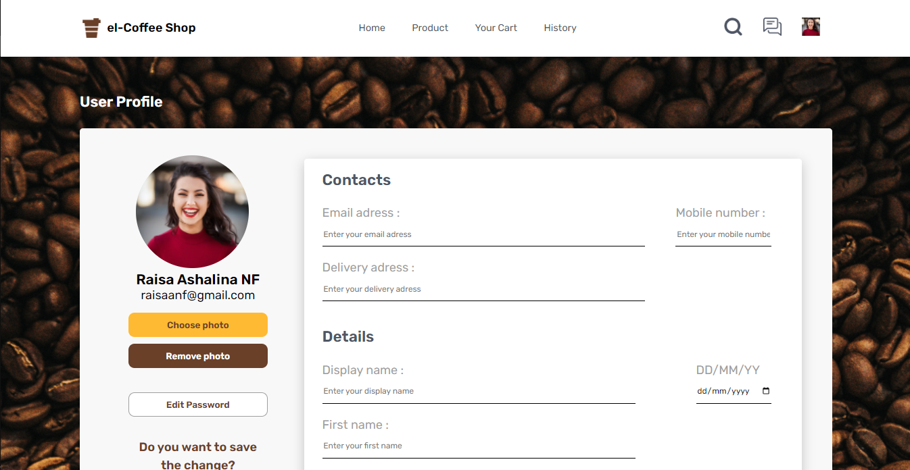
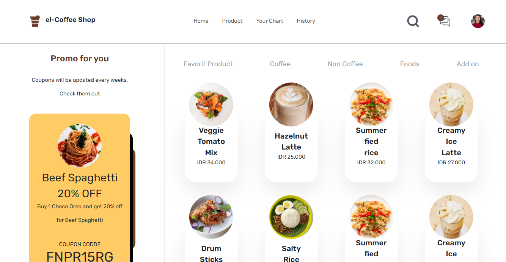

<p align="center">
    
    <h1 align='center'>el-Coffee Shop</h1>
</p>

## Demo

Link demo [el-CoffeeShop](https://github.com/elyasprba/el-coffeShop-backend.git)

## Built With


<br>


## How To Install

1. Clone the repository
   ```
   $ git clone https://github.com/elyasprba/el-coffeShop-frontend.git
   ```
2. Open [VS Code](https://code.visualstudio.com/)
3. Install [Live Server Extension for VS Code](https://marketplace.visualstudio.com/items?itemName=ritwickdey.LiveServer)
4. Right click _index.html_ then choose **Open With Live Server**

## Preview Project

<div style='display:flex;row-gap:20px;flex-direction:column;'>
    
    
    
    
    
</div>

## Related Project

[el-CoffeeShop Backend](https://github.com/elyasprba/el-coffeShop-backend.git)
